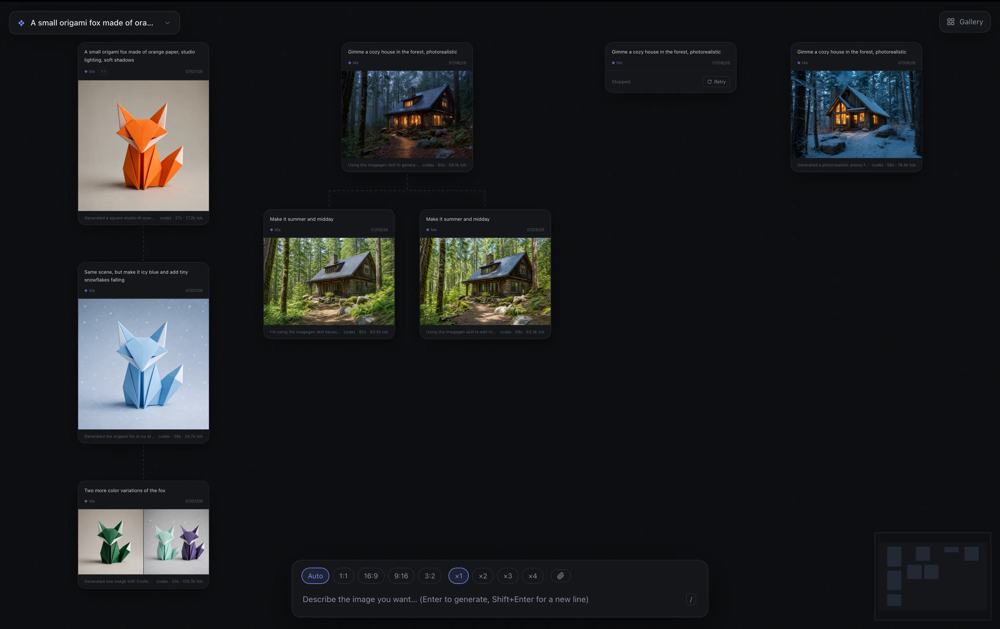

# CodexImage



Local image-generation studio: an infinite node canvas on top of the Codex CLI, so
images generate through **your ChatGPT subscription** — no API costs. Every prompt is
a node; branch, continue, or regenerate any of them, and ×N fans out parallel takes
side by side.

## Installation

Requires Node ≥ 22.7 and the Codex CLI logged in to a ChatGPT account (`codex login`).

```bash
npm install
npm run app:install   # macOS: build and install CodexImage.app into /Applications
```

Or without installing:

```bash
npm run app    # build and open as an Electron window
npm start      # or serve in the browser at http://localhost:4750 (build first: npm run build)
npm run dev    # development: Vite HMR on :5173 + API server
```

## Keybinds

| Key | Action |
|-----|--------|
| `/` | Focus the prompt |
| `Enter` / `Shift+Enter` | Generate / newline |
| `⌘K` | Board switcher |
| `F` | Fit canvas to view |
| `G` | Toggle gallery |
| `Esc` | Close / unfocus |

While hovering a card:

| Key | Action |
|-----|--------|
| `B` | Branch from it |
| `R` | Regenerate |
| `E` | Edit its prompt |
| `D` | Duplicate |
| `Delete` | Delete (undo from the toast) |

In the lightbox:

| Key | Action |
|-----|--------|
| `←` `→` | Step through images, then siblings |
| `↑` `↓` | Jump to parent / child |
| `B` | Branch from this image |
| `Enter` | Quick continue with the typed refinement |
| Scroll / click | Zoom |
